# Checklist de Veículos — Gestão de Frota

Sistema web fullstack para controle de checklist diário de frota veicular, desenvolvido como solução para o desafio técnico **Analista de Sistemas**. A aplicação permite que **colaboradores** registrem inspeções diárias com fotos e respostas padronizadas, enquanto **gestores** aprovam, acompanham indicadores em tempo real e geram relatórios.

> **Deploy em produção:** [acesse a aplicação no Render](https://checklist-de-veiculos.onrender.com)
>
> ⚠️ O serviço utiliza o plano gratuito do Render — após inatividade, o primeiro acesso pode levar ~30 segundos para carregar.

---

## Stack Tecnológica

| Camada | Tecnologia | Justificativa |
|--------|-----------|---------------|
| **Back-end** | **Python 3.12 + FastAPI** | Escolha alinhada ao escopo da vaga — Python como linguagem principal do backend, com FastAPI pela alta performance, tipagem forte via Pydantic e documentação Swagger gerada automaticamente |
| **ORM** | SQLAlchemy 2.x | ORM maduro com suporte a relações complexas e portabilidade entre SQLite (dev) e PostgreSQL (prod) sem alterar código |
| **Banco de dados** | SQLite / PostgreSQL | SQLite para desenvolvimento local rápido (zero config); PostgreSQL em produção para concorrência e robustez |
| **Autenticação** | JWT com roles | Autenticação stateless com tokens e controle de acesso por perfil (gestor/colaborador), sem sessões no servidor |
| **Front-end** | React 18 + Tailwind CSS | SPA com componentização, estilização utilitária mobile-first e responsividade completa |
| **Gráficos** | Recharts | Visualização de dados no dashboard com gráficos semanais de aprovações |
| **Relatórios** | openpyxl + ReportLab | Geração de Excel e PDF no servidor, sem dependência de serviços externos |
| **Deploy** | Render | Web Service + PostgreSQL gerenciado, com build automatizado via push no GitHub |

---

## Checklist de Entrega

### Requisitos Cumpridos

| # | Requisito do Desafio | Status | Onde |
|---|---------------------|--------|------|
| 1 | Importação da base de frota (Excel com 30+ campos) | ✅ | `seed.py` — importa veículos, motoristas e responsáveis |
| 2 | Dois perfis de acesso: Gestor e Colaborador | ✅ | JWT com roles, rotas protegidas por perfil |
| 3 | Checklist diário com upload de **5 fotos obrigatórias** | ✅ | Formulário com validação, aceita câmera ou arquivo |
| 4 | Perguntas de inspeção com respostas Sim/Não | ✅ | Perguntas dinâmicas por tipo de veículo |
| 5 | Registro de quilometragem (KM) | ✅ | Campo com validação em tempo real |
| 6 | Campo de observações | ✅ | Textarea livre no formulário |
| 7 | Aprovação/reprovação pelo gestor | ✅ | Workflow com justificativa obrigatória na reprovação |
| 8 | Dashboard com indicadores | ✅ | Cards de resumo, gráfico semanal, veículos sem checklist |
| 9 | Gestão de veículos (CRUD) | ✅ | 30+ campos preservados do Excel, filtros e detalhes |
| 10 | Gestão de colaboradores (CRUD) | ✅ | Cadastro, vínculo ao veículo, ativar/desativar |
| 11 | Relatórios com filtros | ✅ | Excel e PDF com filtros por período, colaborador, veículo e status |
| 12 | Primeiro acesso com troca de senha obrigatória | ✅ | Redirect automático para tela de troca |

### Funcionalidades Adicionais (iniciativa própria)

| # | Feature | Valor agregado |
|---|---------|---------------|
| 1 | **Perguntas dinâmicas por tipo de veículo** | Carro (8), Utilitário (8) e Caminhão (10) com perguntas específicas para cada categoria |
| 2 | **Pergunta condicional de tração 4x4** | Adicionada automaticamente quando o veículo possui tração 4x4 |
| 3 | **Validação de KM inteligente** | Bloqueia KM inferior ao último registrado, evitando erros de digitação |
| 4 | **Atualização automática de KM** | Ao aprovar checklist, o KM do veículo é atualizado automaticamente |
| 5 | **Filtros inline estilo Excel** | Todas as tabelas com filtros por coluna, similar a planilhas |
| 6 | **Logs de atividade com IP** | Rastreabilidade completa: ação, usuário, IP e data/hora |
| 7 | **Histórico de redefinição de senha** | Gestor visualiza quando e quantas vezes redefiniu a senha de cada colaborador |
| 8 | **Página "Meu Veículo"** | Colaborador visualiza todos os dados do veículo vinculado |
| 9 | **Relatórios em PDF** | Além do Excel solicitado, relatórios também em PDF |
| 10 | **Responsáveis de manutenção** | Gestão e vínculo a veículos, importados do Excel |
| 11 | **Design responsivo mobile-first** | Interface adaptada para desktop, tablet e mobile |
| 12 | **Identidade visual corporativa** | Paleta de cores baseada no site institucional da empresa |
| 13 | **Deploy em produção** | Aplicação publicada no Render com PostgreSQL |
| 14 | **Documentação Swagger automática** | API documentada e testável em `/docs` |

---

## Demonstração Visual

### Login e Primeiro Acesso

Autenticação por matrícula e senha. No primeiro login, o sistema redireciona para troca de senha obrigatória.

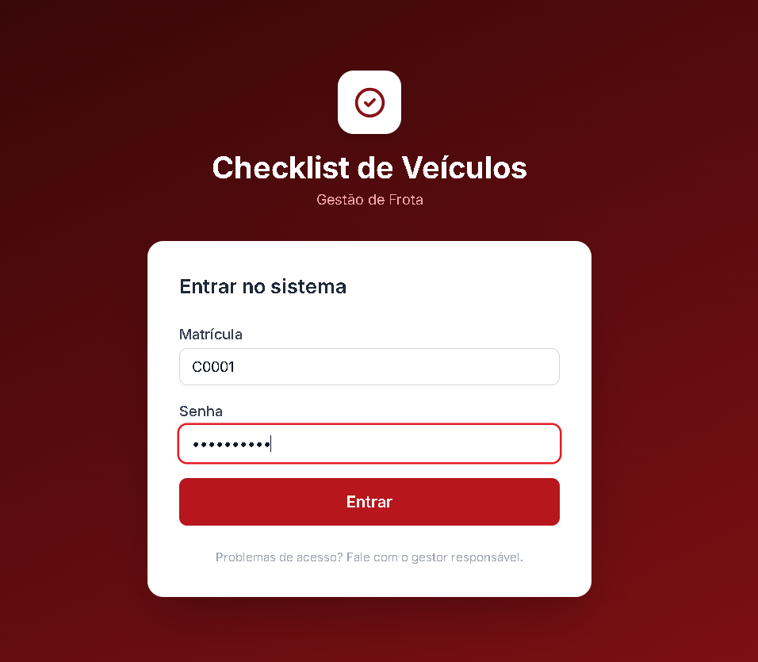

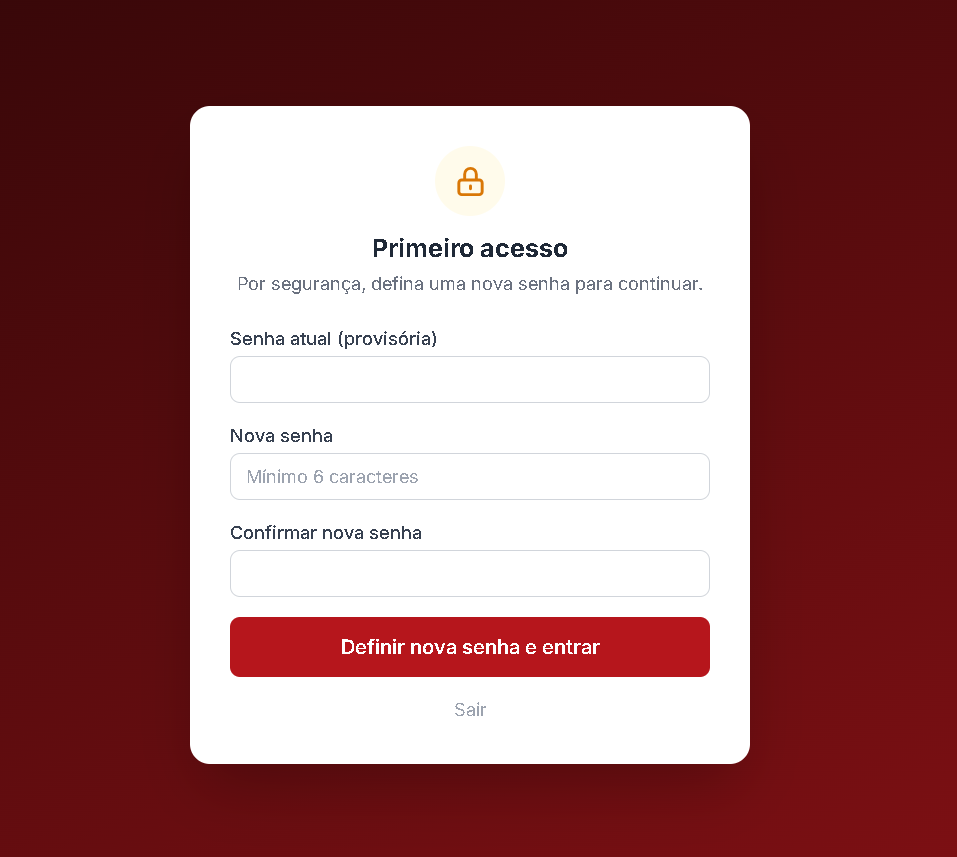

### Área do Gestor

**Dashboard** — Cards de resumo (total, pendentes, aprovados, reprovados), gráfico semanal e veículos sem checklist no dia.

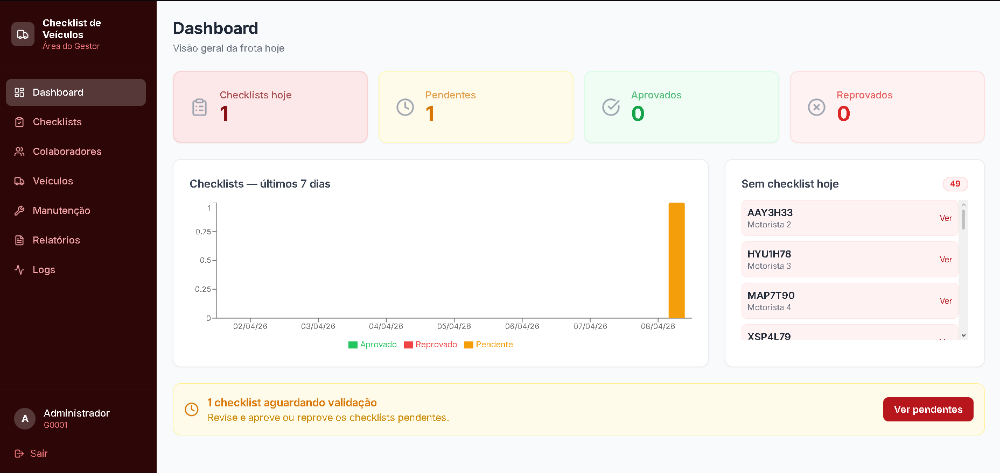

**Checklists** — Listagem com filtros inline por status, colaborador, veículo e período.

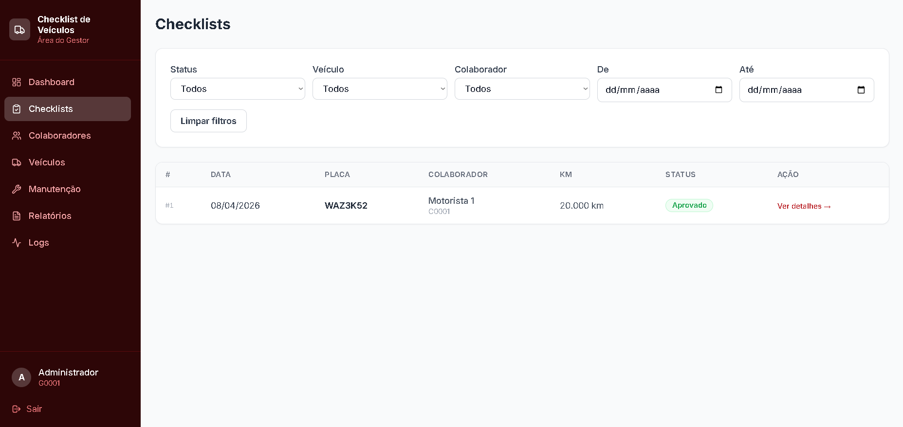

**Detalhe do Checklist** — Fotos, respostas, KM e observações. Aprovação ou reprovação com justificativa obrigatória.

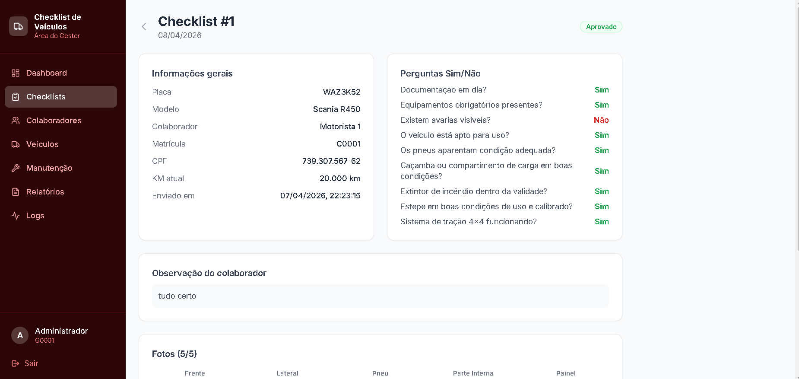

**Veículos** — Frota completa com 30+ campos, filtros, modal de edição e histórico de checklists.

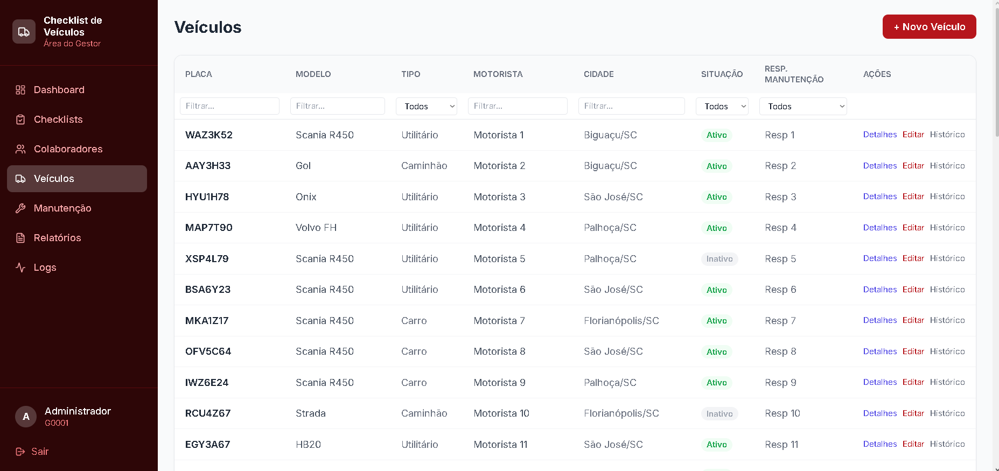

**Colaboradores** — CRUD com vínculo ao veículo, ativar/desativar e redefinir senha.

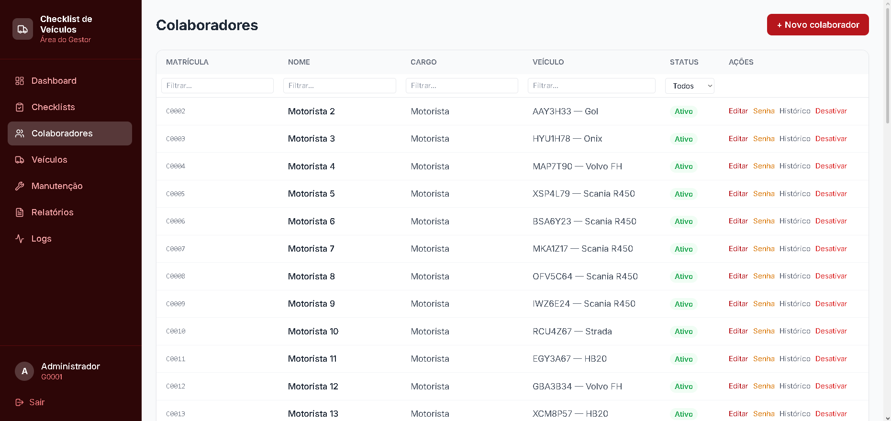

**Relatórios** — Geração sob demanda em Excel e PDF com filtros combinados.

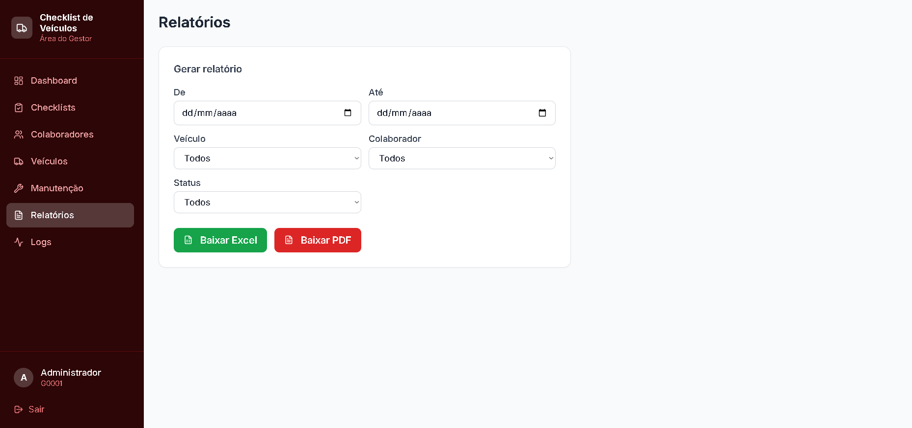

**Logs** — Registro de atividades com ação, usuário, IP e data/hora.

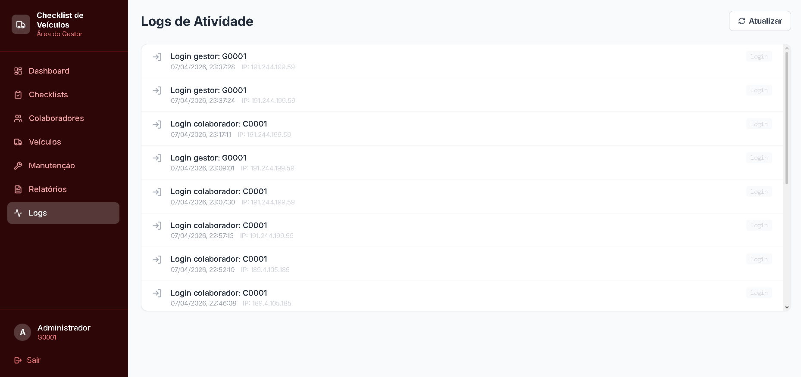

### Área do Colaborador

**Novo Checklist** — 5 fotos obrigatórias, perguntas dinâmicas por tipo de veículo, KM e observações.

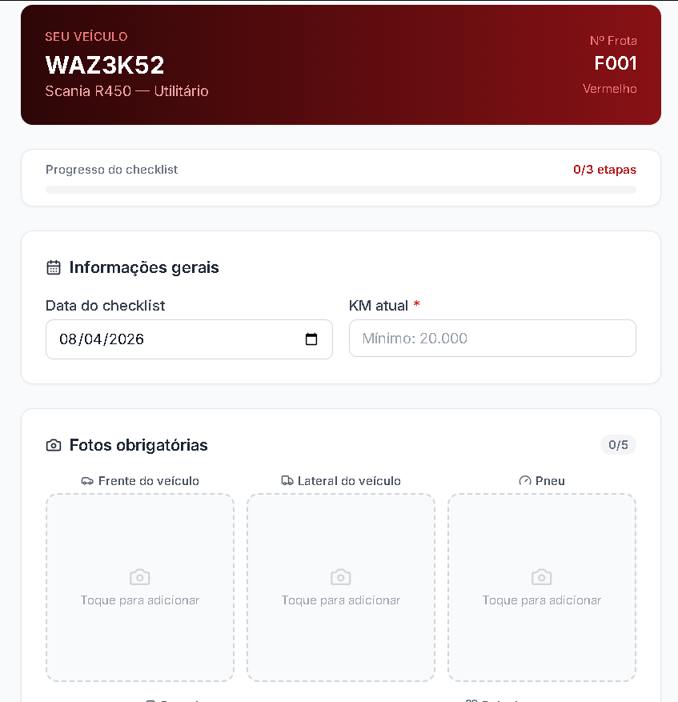

**Perguntas dinâmicas** — Formulário adapta as perguntas ao tipo de veículo (Carro, Utilitário ou Caminhão).

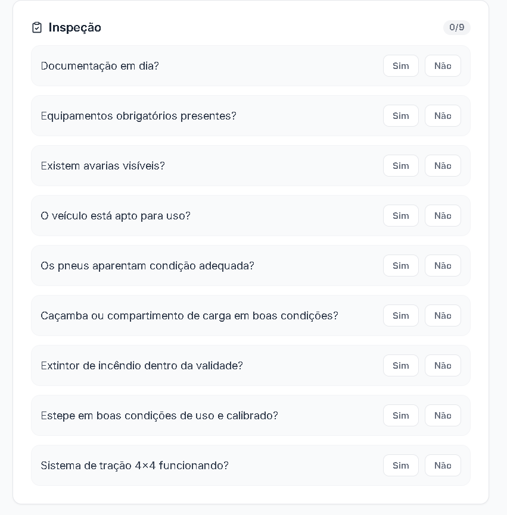

**Meus Checklists** — Histórico com status de aprovação e detalhes completos.

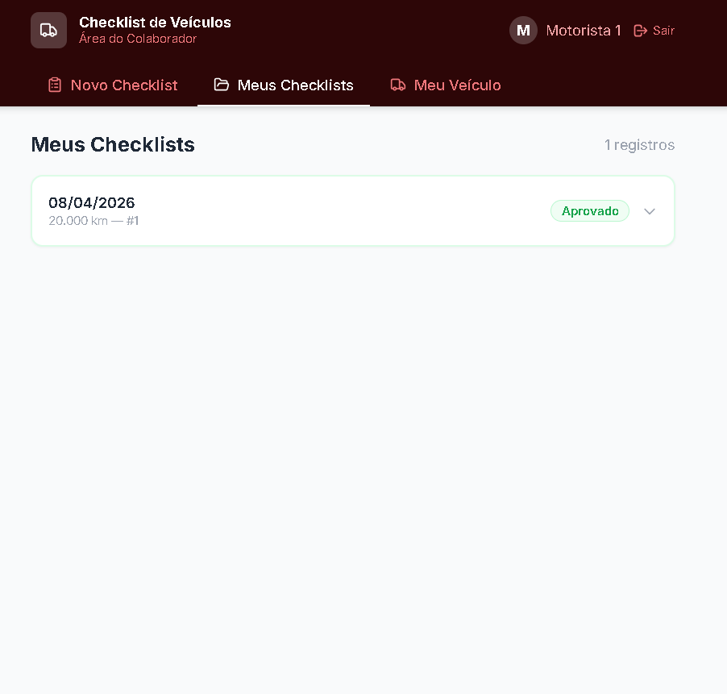

**Meu Veículo** — Dados completos do veículo vinculado ao colaborador.

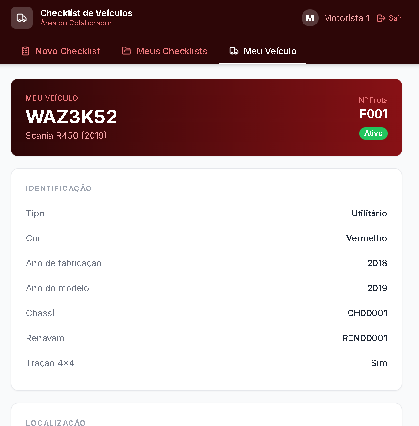

---

## Quick Start

### Pré-requisitos

- Python 3.11+
- Node.js 18+

### 1. Back-end

```bash
cd backend
pip install -r requirements.txt
```

### 2. Seed (importar dados do Excel)

```bash
cd backend
python seed.py ../Teste_Analista_de_Sistemas.xlsx
```

> Sem o Excel: `python seed.py` (cria apenas o gestor e tabelas vazias)

### 3. Iniciar API

```bash
cd backend
uvicorn main:app --reload --port 8000
```

- API: `http://localhost:8000/api`
- Swagger: `http://localhost:8000/docs`

### 4. Front-end

```bash
cd frontend
npm install && npm start
```

- App: `http://localhost:3000`

### Credenciais de acesso

| Perfil | Matrícula | Senha |
|--------|-----------|-------|
| Gestor | G0001 | definir no .env |
| Colaborador | C0001 | C0001@{ano} |
| Colaborador | C0002 | C0002@{ano} |

> Todos os colaboradores devem trocar a senha no primeiro login.

---

## Perguntas do Checklist

**5 perguntas base** aplicadas a todos os veículos:

| # | Pergunta |
|---|----------|
| 1 | Documentação em dia? |
| 2 | Equipamentos obrigatórios presentes? |
| 3 | Existem avarias visíveis? |
| 4 | O veículo está apto para uso? |
| 5 | Os pneus aparentam condição adequada? |

**Perguntas adicionais por tipo:**

| # | Carro | Utilitário | Caminhão |
|---|-------|------------|----------|
| 6 | Ar-condicionado funcionando? | Caçamba/compartimento de carga em boas condições? | Tacógrafo funcionando? |
| 7 | Cintos de segurança funcionando e sem rasgos? | Extintor de incêndio dentro da validade? | Luzes e sinalização traseira funcionando? |
| 8 | Estepe em boas condições e calibrado? | Estepe em boas condições e calibrado? | Freio de estacionamento funcionando? |
| 9 | — | — | Lona/corda de amarração em boas condições? |
| 10 | — | — | Extintor de incêndio dentro da validade? |

> **Condicional:** Se tração 4x4 → *"Sistema de tração 4x4 funcionando?"*
>
> **Total:** Carro: 8 | Utilitário: 8 | Caminhão: 10 (+1 se 4x4)

---

## Automações do Sistema

| # | Automação | Gatilho |
|---|-----------|---------|
| 1 | Bloqueio de envio sem as 5 fotos | Ao enviar checklist |
| 2 | Bloqueio para veículo inativo | Ao enviar checklist |
| 3 | Validação de KM (rejeita valor menor que o atual) | Ao preencher formulário |
| 4 | Atualização automática do KM do veículo | Ao gestor aprovar |
| 5 | Status automático (aprovado/reprovado) | Ao gestor validar |
| 6 | Justificativa obrigatória na reprovação | Ao reprovar |

---

## Endpoints da API

Todas as rotas sob `/api`. Documentação interativa em `/docs` (Swagger).

<details>
<summary><strong>Autenticação</strong> (3 rotas)</summary>

| Método | Rota | Descrição |
|--------|------|-----------|
| POST | `/auth/login` | Autenticar usuário |
| POST | `/auth/trocar-senha` | Trocar senha |
| GET | `/auth/me` | Dados do usuário logado |

</details>

<details>
<summary><strong>Gestor</strong> (9 rotas)</summary>

| Método | Rota | Descrição |
|--------|------|-----------|
| GET | `/gestor/perfil` | Perfil do gestor |
| PUT | `/gestor/perfil` | Atualizar perfil |
| GET | `/gestor/colaboradores` | Listar colaboradores |
| POST | `/gestor/colaboradores` | Criar colaborador |
| GET | `/gestor/colaboradores/{id}` | Detalhes do colaborador |
| PUT | `/gestor/colaboradores/{id}` | Atualizar colaborador |
| POST | `/gestor/colaboradores/{id}/redefinir-senha` | Redefinir senha |
| GET | `/gestor/colaboradores/{id}/historico-senha` | Histórico de redefinições |
| GET | `/gestor/logs` | Logs de atividades |

</details>

<details>
<summary><strong>Veículos</strong> (8 rotas)</summary>

| Método | Rota | Descrição |
|--------|------|-----------|
| GET | `/veiculos` | Listar veículos |
| POST | `/veiculos` | Cadastrar veículo |
| GET | `/veiculos/meu-veiculo` | Veículo do colaborador |
| GET | `/veiculos/{id}` | Detalhes do veículo |
| PUT | `/veiculos/{id}` | Atualizar veículo |
| GET | `/veiculos/responsaveis/manutencao` | Listar responsáveis |
| POST | `/veiculos/responsaveis/manutencao` | Cadastrar responsável |
| PUT | `/veiculos/responsaveis/manutencao/{id}` | Atualizar responsável |

</details>

<details>
<summary><strong>Checklists</strong> (7 rotas)</summary>

| Método | Rota | Descrição |
|--------|------|-----------|
| POST | `/checklists` | Enviar checklist com fotos |
| GET | `/checklists/meus` | Meus checklists |
| GET | `/checklists` | Listar todos (gestor) |
| GET | `/checklists/dashboard` | Dashboard com resumo |
| GET | `/checklists/{id}` | Detalhes do checklist |
| PATCH | `/checklists/{id}/validar` | Aprovar/reprovar |
| GET | `/checklists/historico/veiculo/{id}` | Histórico por veículo |

</details>

<details>
<summary><strong>Relatórios</strong> (4 rotas)</summary>

| Método | Rota | Descrição |
|--------|------|-----------|
| GET | `/relatorio/configuracao` | Obter configuração |
| PUT | `/relatorio/configuracao` | Atualizar configuração |
| GET | `/relatorio/excel` | Baixar Excel |
| GET | `/relatorio/pdf` | Baixar PDF |

</details>

---

## Design e Identidade Visual

A paleta de cores foi escolhida com base na **identidade visual do site institucional da empresa**, utilizando o vermelho corporativo como cor primária.

| Token | Hex | Uso |
|-------|-----|-----|
| `primary-900` | `#2d0607` | Sidebar, cabeçalhos, gradiente do login |
| `primary-600` | `#b6161c` | Botões principais, links, ações |
| `primary-50` | `#fce8e9` | Backgrounds de destaque |
| `success` | `#22c55e` | Aprovado, ativo |
| `warning` | `#f59e0b` | Pendente, alertas |
| `danger` | `#ef4444` | Reprovado, erros |

**Estilo visual:** Interface limpa com cards arredondados, fonte Inter, ícones Lucide, design responsivo mobile-first com breakpoints `sm`/`md`/`lg`.

---

## Decisões Técnicas

| Tecnologia | Por quê? |
|------------|----------|
| **Python + FastAPI** | Linguagem alinhada ao escopo da vaga. FastAPI oferece alta performance, tipagem forte e documentação Swagger automática |
| **SQLAlchemy 2.x** | ORM robusto com portabilidade SQLite ↔ PostgreSQL sem alterar código |
| **JWT** | Autenticação stateless sem sessões, facilitando escalabilidade |
| **React 18 + Tailwind** | SPA com componentização e estilização utilitária que acelera desenvolvimento |
| **Recharts** | Gráficos nativos em React, leves e configuráveis |
| **openpyxl + ReportLab** | Relatórios Excel e PDF gerados no servidor, sem serviços externos |
| **Render** | Deploy gratuito com PostgreSQL gerenciado e build automatizado via GitHub |

---

## Estrutura do Projeto

```
checklist-veiculos/
├── backend/
│   ├── core/           # config, database, JWT, dependencies
│   ├── models/         # SQLAlchemy models (usuário, veículo, checklist, log)
│   ├── schemas/        # Pydantic schemas (validação de entrada/saída)
│   ├── routes/         # endpoints FastAPI (auth, gestor, veículos, checklist, relatório)
│   ├── services/       # upload de fotos, geração de relatórios (Excel/PDF)
│   ├── uploads/        # fotos salvas localmente
│   ├── main.py         # app FastAPI + serving do React em produção
│   ├── seed.py         # popular banco (gestor + dados do Excel)
│   └── requirements.txt
├── frontend/
│   └── src/
│       ├── pages/
│       │   ├── gestor/       # Dashboard, Checklists, Colaboradores, Veículos, Relatórios, Logs
│       │   └── colaborador/  # NovoChecklist, MeusChecklists, MeuVeiculo
│       ├── components/       # componentes reutilizáveis (Modal, Badge, StatCard, etc.)
│       ├── context/          # AuthContext (JWT + roles)
│       └── services/         # api.js (axios com interceptors)
├── build.sh            # script de build para Render
├── render.yaml         # Blueprint de deploy (web service + PostgreSQL)
└── .gitignore
```


